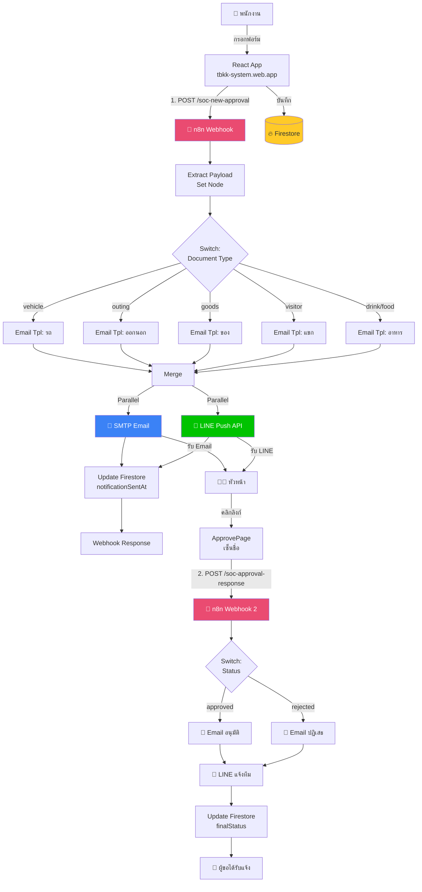

# 🤖 TBKK SOC - Auto Approval Notification System (n8n)

> ระบบอัตโนมัติแจ้งเตือนและจัดการเอกสารอนุมัติ ของ **TBKK Group** สร้างด้วย **n8n Workflow Automation**

[](https://n8n.io)
[](https://firebase.google.com)
[](https://developers.line.biz)
[]()

---

## 📌 Use Case จริง (Real-World Problem)

ในระบบ **TBKK SOC** (Visitor & Document Management System) ของบริษัท TBK Group เดิมเมื่อพนักงานยื่นเอกสารขออนุมัติ (เช่น ขอใช้รถ, นำของเข้า-ออก, ผู้มาติดต่อ) ต้อง:

❌ **ปัญหาเดิม:**
1. เดินไปแจ้งหัวหน้าด้วยตนเองว่ามีเอกสารรออนุมัติ
2. หัวหน้าไม่รู้ว่ามีเอกสารใหม่ ต้องเปิดเว็บเช็คเอง
3. ผู้ขอไม่รู้ผลทันที ต้องโทรถาม
4. ทีมไม่เห็นภาพรวม ทำให้คอขวด

✅ **แก้ปัญหาด้วย n8n:**
1. เมื่อพนักงานยื่นเอกสาร → ระบบ trigger webhook ไปยัง n8n อัตโนมัติ
2. n8n แตกตามประเภทเอกสาร (Switch) → ส่ง Email + LINE แจ้งหัวหน้าทันที
3. หัวหน้าคลิกลิงก์ในอีเมล → อนุมัติ/ปฏิเสธ → trigger webhook กลับมาที่ n8n
4. n8n update Firestore + แจ้งผู้ขอ ผ่าน Email + LINE

⏱️ **ผลลัพธ์:** จากเดิมรอ 2-3 ชั่วโมง → เหลือไม่ถึง 2 นาที

---

## 🏗️ สถาปัตยกรรมระบบ (Architecture)



---

## 🔌 บริการที่เชื่อมต่อ (Integrations)

| ✅ ระบบ | ใช้ทำอะไร | ประเภท |
|---|---|---|
| **Webhook** (ขาเข้า x2) | รับเอกสารใหม่ + รับผลอนุมัติ | HTTP API |
| **Firestore** (Google) | อัพเดต status ของเอกสาร | Database |
| **SMTP / Gmail** | ส่งอีเมลถึงหัวหน้า + ผู้ขอ | Email Service |
| **LINE Messaging API** | ส่งข้อความเข้า LINE Group | Messaging |
| **React Web App** | ระบบหลัก (เรียก webhook) | Web Frontend |

> 📦 **5+ services** เชื่อมต่อกันผ่าน n8n เป็นศูนย์กลาง orchestration

---

## ⚡ คุณสมบัติหลัก (Features)

- 🚀 **Real-time:** แจ้งเตือนทันทีหลังยื่นเอกสาร (< 2 วินาที)
- 🔀 **Multi-channel:** ส่งทั้ง Email + LINE พร้อมกัน
- 🎯 **Smart routing:** Switch node แตกตาม 6 ประเภทเอกสาร
- 🔁 **Bi-directional:** ทั้งแจ้งหัวหน้า และแจ้งกลับผู้ขอ
- 📊 **Audit trail:** บันทึกทุกการแจ้งเตือนใน Firestore
- 🧩 **Modular:** เพิ่ม channel ใหม่ (Slack, Discord, Teams) ได้ใน 5 นาที

---

## 📂 โครงสร้างไฟล์

```
n8n-workflow/
├── README.md                                    ← ไฟล์นี้
├── workflows/
│   ├── 01-new-approval-notification.json        ← Workflow แจ้งเตือนเอกสารใหม่
│   └── 02-approval-response-notification.json   ← Workflow แจ้งผลอนุมัติ
├── docs/
│   ├── ARCHITECTURE.md      ← สถาปัตยกรรมรายละเอียด
│   ├── SETUP.md             ← วิธี import + ตั้งค่า credentials
│   ├── INTEGRATION.md       ← วิธีเชื่อม React App
│   └── DEMO_SCRIPT.md       ← สคริปต์อัด VDO นำเสนอ
├── test/
│   └── sample-payloads.json ← payload สำหรับทดสอบ
└── screenshots/             ← screenshot ระบบ (ใส่ตอนอัด VDO)
```

---

## 🚀 Quick Start

```bash
# 1. ติดตั้ง n8n (Docker - ง่ายสุด)
docker run -d --name n8n -p 5678:5678 \
  -v n8n_data:/home/node/.n8n \
  n8nio/n8n

# 2. เปิด http://localhost:5678 → สร้าง account

# 3. Import workflow
#    Settings (มุมล่างซ้าย) → Workflows → Import from File
#    เลือก workflows/01-new-approval-notification.json
#    ทำซ้ำกับ 02-approval-response-notification.json

# 4. ตั้งค่า credentials (ดูใน docs/SETUP.md)
#    - SMTP / Gmail
#    - LINE Channel Access Token
#    - Firebase Firestore OAuth2

# 5. เปิดใช้งาน workflow (toggle "Active" มุมขวาบน)

# 6. ทดสอบ
curl -X POST http://localhost:5678/webhook/soc-new-approval \
  -H "Content-Type: application/json" \
  -d @test/sample-payloads.json
```

📖 ดูคู่มือเต็มที่ [docs/SETUP.md](docs/SETUP.md)

---

## 👥 สมาชิกกลุ่ม

| ลำดับ | ชื่อ-นามสกุล | รหัสนักศึกษา | หน้าที่ |
|------|------------|--------------|--------|
| 1 | (ใส่ชื่อ) | (รหัส) | Workflow Designer |
| 2 | (ใส่ชื่อ) | (รหัส) | Frontend Integration |
| 3 | (ใส่ชื่อ) | (รหัส) | n8n Configuration |
| 4 | (ใส่ชื่อ) | (รหัส) | Firebase / API |
| 5 | (ใส่ชื่อ) | (รหัส) | Documentation & VDO |

---

## 📺 VDO นำเสนอ

🔗 (วาง link OneDrive ที่นี่ตอนอัดเสร็จ)

ดูสคริปต์อัด VDO ได้ที่ [docs/DEMO_SCRIPT.md](docs/DEMO_SCRIPT.md)

---

## 🎓 อ้างอิง

- **n8n Docs:** https://docs.n8n.io
- **Firebase Firestore REST API:** https://firebase.google.com/docs/firestore/reference/rest
- **LINE Messaging API:** https://developers.line.biz/en/reference/messaging-api/
- **Project SOC (ระบบหลัก):** https://tbkk-system.web.app

---

## 📝 License

MIT — ใช้เพื่อการศึกษา (รายวิชา Workflow Automation)
