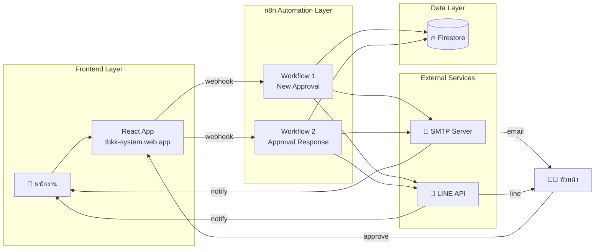
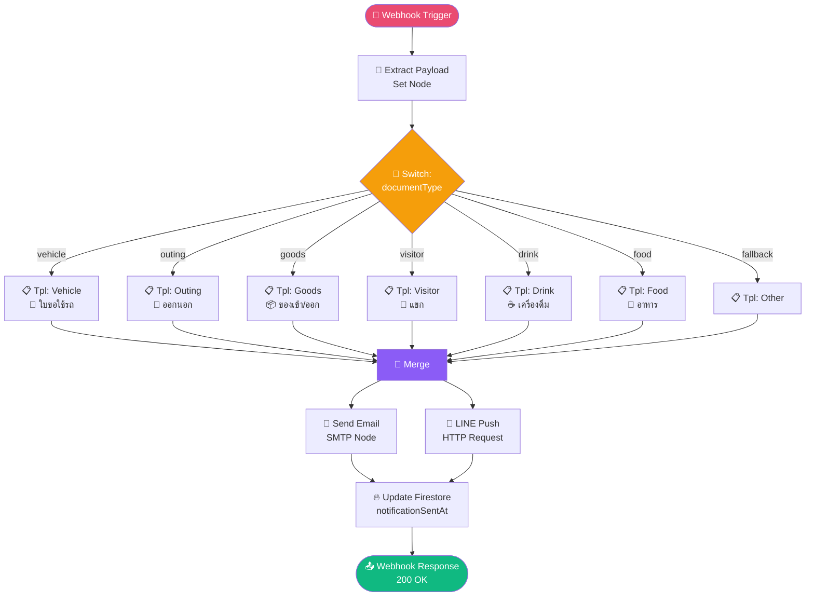
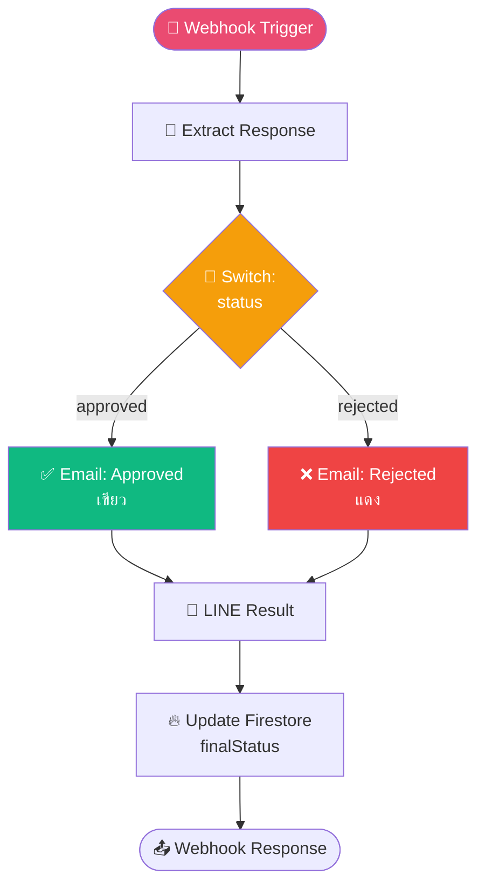
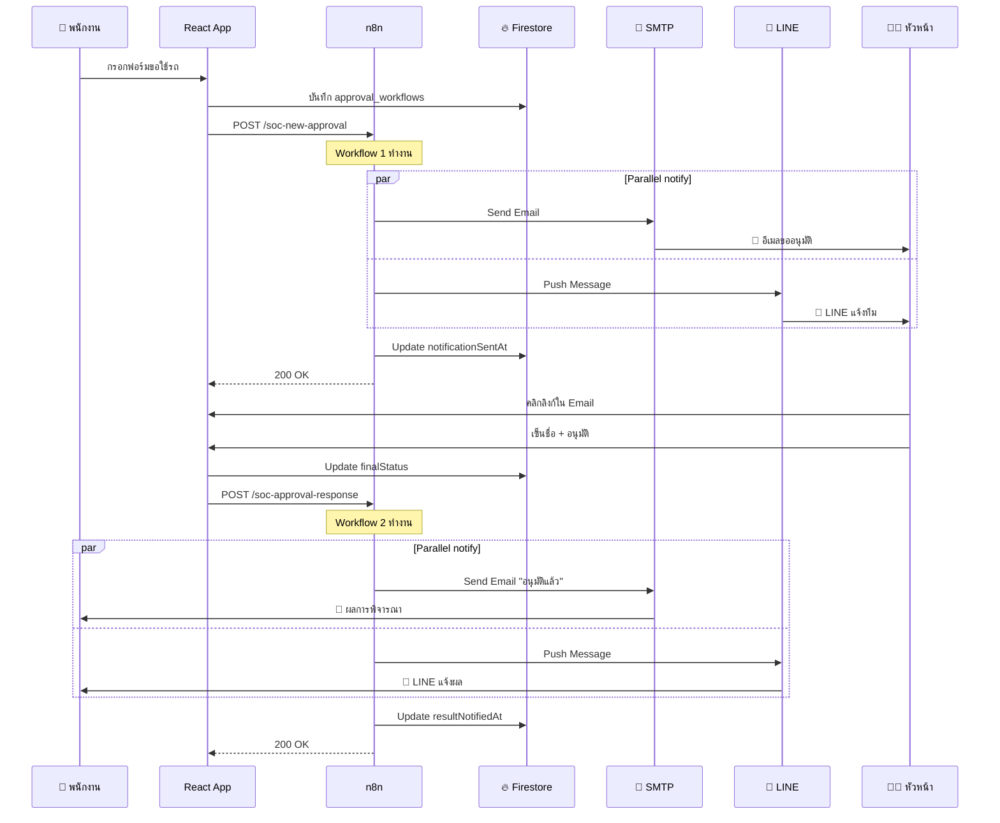

# 🏗️ Architecture - TBKK SOC Auto Approval System

> รายละเอียดเชิงลึกของสถาปัตยกรรม workflow

---

## 1. ภาพรวมระบบ (System Overview)



---

## 2. Workflow 1: New Approval Notification

**Trigger:** Webhook `POST /webhook/soc-new-approval`



### ขั้นตอนการทำงาน

| # | Node | หน้าที่ | Output |
|---|------|--------|--------|
| 1 | Webhook | รับ HTTP POST จาก React App | raw body |
| 2 | Extract Payload | แตก payload เป็น variables | `documentId`, `requesterName`, ... |
| 3 | Switch | แยกเส้นทางตามประเภทเอกสาร (6 + fallback) | route ที่ตรง |
| 4 | Tpl: * | ตั้ง email subject + emoji + title ตามประเภท | `emailSubject`, `emoji`, `docTitle` |
| 5 | Merge | รวมเส้นทางทั้งหมด (number of inputs = 7) | unified payload |
| 6a | Email Send | ส่งอีเมล HTML ไปยังหัวหน้า | message ID |
| 6b | LINE Push | ส่งข้อความเข้า LINE Group ผ่าน Messaging API | LINE response |
| 7 | Update Firestore | PATCH `approval_workflows/{id}` | updated doc |
| 8 | Respond | ส่ง 200 + JSON กลับให้ React App | success response |

### Input Schema (Webhook Body)

```json
{
  "documentId": "WF-2026-04-25-001",
  "documentType": "vehicle",
  "requesterName": "อรรถชัย กิตติมโนรักษ์",
  "requesterDept": "EEE",
  "requesterEmail": "intern_attachai.k@tbkk.co.th",
  "approverEmail": "sarayut_r@tbkk.co.th",
  "approveUrl": "https://tbkk-system.web.app/approve?id=WF-2026-04-25-001",
  "details": "ขอใช้รถไปประชุมที่บริษัทคู่ค้า"
}
```

### Output Schema (Webhook Response)

```json
{
  "success": true,
  "documentId": "WF-2026-04-25-001",
  "message": "Notifications sent via Email + LINE",
  "timestamp": "2026-04-25T10:30:00.000Z"
}
```

---

## 3. Workflow 2: Approval Response Notification

**Trigger:** Webhook `POST /webhook/soc-approval-response`



### Input Schema

```json
{
  "documentId": "WF-2026-04-25-001",
  "documentType": "vehicle",
  "status": "approved",
  "approverName": "นายสารยุทธ ระวังวงค์",
  "requesterEmail": "intern_attachai.k@tbkk.co.th",
  "requesterName": "อรรถชัย กิตติมโนรักษ์",
  "comment": "อนุมัติ ใช้ระวังบนถนนด้วย"
}
```

---

## 4. การไหลของข้อมูล (Data Flow)



---

## 5. Firestore Schema

**Collection:** `artifacts/{appId}/public/data/approval_workflows/{documentId}`

```typescript
{
  // เดิมจาก React App
  documentId: string,
  documentType: "vehicle" | "outing" | "goods" | "visitor" | "drink" | "food",
  requesterName: string,
  requesterDept: string,
  status: "pending" | "approved" | "rejected",
  createdAt: Timestamp,
  
  // ✨ เพิ่มจาก n8n
  notificationSentAt: Timestamp,        // workflow 1 อัพเดต
  notificationChannels: ["email", "line"],
  finalStatus: "approved" | "rejected", // workflow 2 อัพเดต
  decidedAt: Timestamp,
  resultNotifiedAt: Timestamp
}
```

---

## 6. ทำไมเลือก n8n?

| ✅ ข้อดี | คำอธิบาย |
|---------|---------|
| **Open-source** | ใช้ฟรี self-host ได้ ไม่มี vendor lock-in |
| **Visual** | ลาก-วาง node เห็นภาพ workflow ทันที |
| **400+ integrations** | มี node สำเร็จรูปสำหรับ Gmail, LINE, Firebase, Slack ฯลฯ |
| **Custom code** | เขียน JavaScript ใน Code node ได้ถ้าต้องการ |
| **Webhook native** | สร้าง endpoint รับ HTTP ได้เลย ไม่ต้องเขียน server |
| **Error retry** | retry อัตโนมัติเมื่อ node fail |
| **Audit log** | เก็บประวัติทุก execution ดู debug ได้ |

---

## 7. การขยายระบบในอนาคต (Future Extension)

🔮 สามารถเพิ่มได้:

1. **Slack/Teams notification** — เพิ่ม HTTP node อีก 1 ตัวขนานกับ LINE
2. **SMS แจ้งเตือนฉุกเฉิน** — Twilio API
3. **Auto-escalation** — ถ้าหัวหน้าไม่อนุมัติใน 4 ชั่วโมง → แจ้ง CEO
4. **AI summary** — เพิ่ม OpenAI node สรุปเอกสารยาวให้สั้น
5. **Daily digest** — Cron Trigger ส่งสรุปรายงาน 17:00 ทุกวัน
6. **Document OCR** — ถ้าผู้ขออัพโหลดรูปเอกสาร → ใช้ Google Vision อ่านอัตโนมัติ
